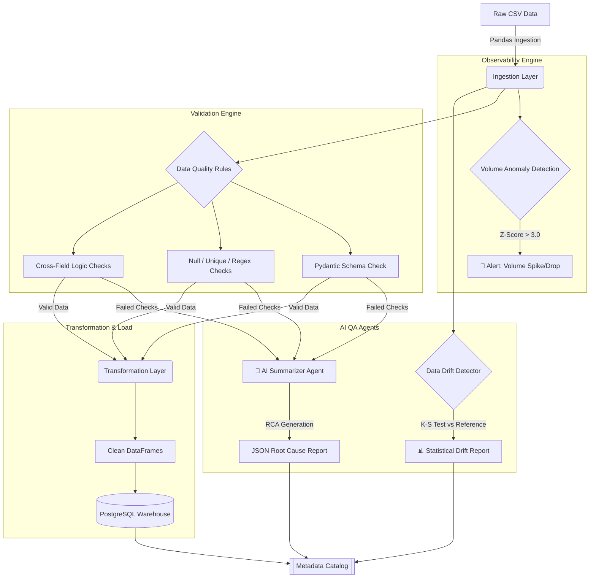

<div align="center">
  <h1>🚀 Data Reliability & AI QA Suite</h1>
  <p><b>A Master-Level Data Quality, Observability, and AI Testing Framework</b></p>
  
  [](https://www.python.org)
  [](https://docs.pytest.org)
  [](https://docs.pydantic.dev/)
  [](https://www.postgresql.org/)
  [](https://www.docker.com/)
</div>

<br/>

## 🎯 Overview

This repository showcases a **production-grade Data Reliability Platform**. It simulates a modern data engineering ecosystem where raw gaming data (players, sessions, transactions) is ingested, rigorously validated, cleaned, and loaded into a warehouse. 

Moving beyond traditional QA, this suite integrates **AI Agents**, **Data Drift Detection**, and **Statistical Observability** to ensure data health at an enterprise scale.

---

## 🧠 Architectural Flow



---

## 🌟 Key Features

### 1. Advanced Data Validation (The Engine)
Built with **Pydantic V2** and Pandas, the engine supports:
- **Structural Integrity**: Strict schema enforcement and type coercion.
- **Content Rules**: Regex pattern matching (e.g., email validation).
- **Relational Logic**: Cross-field logical checks (e.g., `start_date < end_date`).
- **Statistical Thresholds**: Range bounds and accepted value mapping.

### 2. AI-Assisted QA (The Brain)
- **AI Failure Summarizer**: An agent that digests raw JSON failure logs and generates human-readable Root Cause Analysis (RCA) reports, categorizing severity and suggesting fixes.
- **Data Drift Detection**: Utilizes `scipy` (Kolmogorov-Smirnov test) to monitor statistical shifts in data distributions over time, preventing silent ML model degradation.

### 3. Proactive Observability (The Pulse)
- **Anomaly Engine**: Calculates Z-scores on incoming data volumes against historical baselines to catch upstream pipeline breakages immediately.
- **Metadata Catalog**: A local JSON-based tracker that logs every pipeline run, generating a "Health Score" for data observability.

---

## 🛠️ Tech Stack & Tooling
| Layer | Technology | Purpose |
|-------|------------|---------|
| **Core Logic** | Python (3.11+), Pandas | High-performance data manipulation |
| **Validation** | Pydantic V2 | Declarative data contracts |
| **Testing** | Pytest, Allure | Test execution and visual reporting |
| **Storage** | PostgreSQL, SQLAlchemy | Data warehouse simulation |
| **Infrastructure** | Docker Compose, GitHub Actions | CI/CD and containerization |

---

## 🚀 Getting Started

### Prerequisites
- Python 3.11+
- Docker (for local PostgreSQL testing)

### 1. Installation
```bash
# Clone repository
git clone https://github.com/yourusername/dataQA.git
cd dataQA

# Install dependencies
pip install -r requirements.txt
```

### 2. Run the Full AI QA Pipeline
The `main.py` script executes the entire flow: Ingestion -> Anomaly Detection -> Validation -> AI Summarization -> Data Drift Analysis -> Transformation -> Loading.
```bash
# Ensure local imports work correctly
export PYTHONPATH=.

# Execute pipeline
python3 main.py
```

### 3. Run the Test Suite
Execute the multi-layered `pytest` suite covering Ingestion, Transformation, Validation, Observability, and AI Agents:
```bash
export PYTHONPATH=.
pytest -v
```

---

## 📂 Repository Structure Highlights
- **`src/validation/engine.py`**: The core rules engine.
- **`src/ai_agents/`**: Contains the LLM Summarizer and Drift Detector logic.
- **`src/observability/`**: Anomaly detection and Metadata Catalog.
- **`tests/`**: Comprehensive Pytest coverage.
- **`.antigravity/`**: The "Agent Brain" directory containing the architectural plans and Master SDET skills used to generate this project.

---
*Architected and developed as a blueprint for Master-Level Data Reliability Engineering.*
